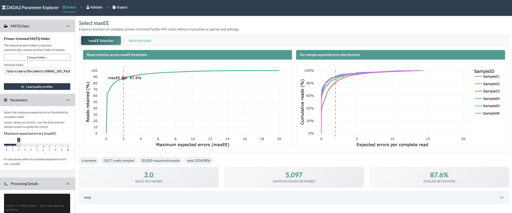
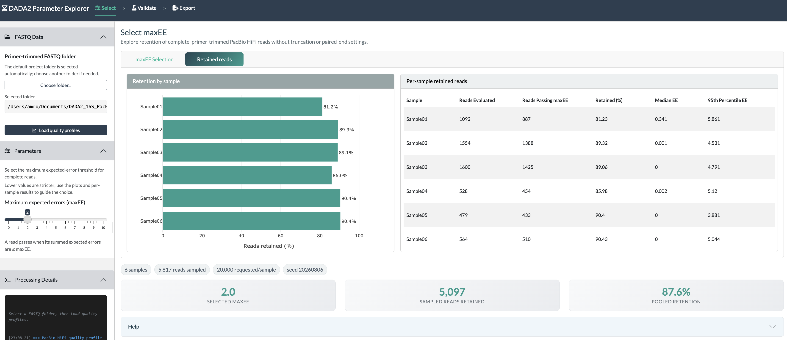
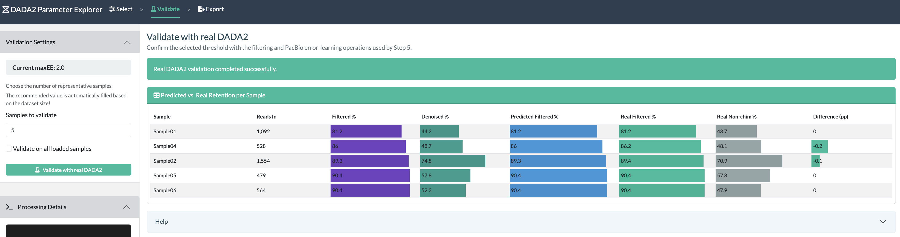
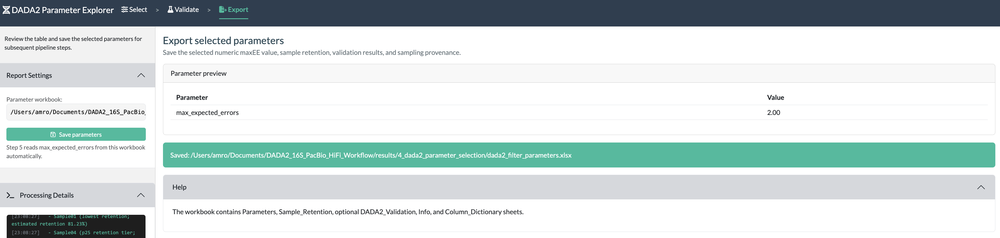

```{r setup, include=FALSE}
# This notebook is a guide to the interactive Shiny app. Its code examples are
# displayed for reproducibility but are not executed while knitting.
knitr::opts_chunk$set(eval = FALSE, echo = TRUE)
```

```{css custom-styles, echo=FALSE, eval=knitr::is_html_output()}
body { font-size: 16px; line-height: 1.6; }
h1, h2, h3 { color: #2c3e50; margin-top: 1.5em; }
code {
  background-color: #F2F2F2;
  color: #2c3e50;
  padding: 2px 6px;
  border-radius: 3px;
  font-size: 14px;
}
pre, pre code { font-size: 14px; }
.alert-info {
  background-color: #2c3e50;
  color: #ffffff;
  border-left: 4px solid #f39c12;
  padding: 12px;
  margin: 15px 0;
}
.alert-warning {
  background-color: #2c3e50;
  color: #ffffff;
  border-left: 4px solid #e74c3c;
  padding: 12px;
  margin: 15px 0;
}
table { width: 100%; display: block; overflow-x: auto; white-space: nowrap; }
th, td { text-align: left !important; white-space: nowrap !important; }
```

# Introduction

## Purpose

This notebook is **Step 4** of the PacBio HiFi full-length 16S workflow. It explains how to use the [PacBio HiFi maxEE Parameter Explorer](../shiny/dada2_parameter_selection_app.R) to select the maximum expected-error threshold used by the [DADA2 pipeline in Step 5](5_dada2_pipeline.md).

PacBio HiFi reads span the complete amplicon, so this app does not select `truncLen`, paired-read overlap, or separate forward and reverse parameters. It evaluates only `maxEE` while preserving complete reads.

## Prerequisites

Before opening the app, confirm that:

1. [Step 3](3_primer_trimming.md) completed successfully.
2. Primer-trimmed FASTQ files are present in [results/3_primer_trimming/primer_trimmed_reads/](../../results/3_primer_trimming/primer_trimmed_reads/).
3. The required R packages were installed with [setup/install_R_dependencies.R](../../setup/install_R_dependencies.R).

## Expected Output

The app writes one Excel workbook:

- [results/4_dada2_parameter_selection/dada2_filter_parameters.xlsx](../../results/4_dada2_parameter_selection/dada2_filter_parameters.xlsx)

The workbook contains the selected numeric `max_expected_errors` value, per-sample estimated retention, provenance, optional real-DADA2 validation results, and a `Column_Dictionary` sheet. [Step 5](5_dada2_pipeline.md) loads this workbook automatically. If it is absent, Step 5 uses its documented fallback value.

------------------------------------------------------------------------

# Start the App

Open the project in RStudio and run the following command from the project root.

```{r launch-app}
# Launch the PacBio-specific maxEE parameter-selection application.
shiny::runApp(here::here("R", "shiny", "dada2_parameter_selection_app.R"))
```

The app presents three tabs in the order they should be used. A shared **Processing Details** console follows the active tab and records data loading, validation, errors, and export events.

| Tab | Purpose |
|---|---|
| **Select** | Load the Step 3 FASTQs, inspect expected-error distributions, and select `maxEE`. |
| **Validate** | Confirm the selected value by running real DADA2 filtering, PacBio error learning, and sample inference. |
| **Export** | Save the selected value and supporting tables to the Step 4 Excel workbook. |

Detailed help is available in collapsible panels within the relevant tab. The **Processing Details** console moves to the active tab and retains its history, so loading, validation, errors, and export messages remain visible throughout the workflow.

------------------------------------------------------------------------

# Understanding maxEE

For each base with Phred quality score (Q), the estimated probability that the base is incorrect is:

\[
P(error) = 10^{-Q/10}
\]

DADA2 sums these probabilities across every base in a read:

\[
EE = \sum_i 10^{-Q_i/10}
\]

A read passes when:

\[
EE \leq maxEE
\]

This is a read-level filter. It differs from the mean-Q20 filter in [Step 2](2_quality_filtering.md): two reads with the same mean quality can have different expected-error totals because their individual base qualities differ.

For full-length reads, expected errors accumulate over approximately 1,500 bases. Consequently, `maxEE = 2` is a useful starting value but is not automatically optimal for every PacBio run.

------------------------------------------------------------------------

# Select maxEE

## Load Expected-Error Profiles

In the **Select** tab:

1. Use **Choose FASTQ folder** and select [results/3_primer_trimming/primer_trimmed_reads/](../../results/3_primer_trimming/primer_trimmed_reads/).
2. Click **Load quality profiles**.

The app streams every complete FASTQ and uses reproducible reservoir sampling across the whole file, rather than reading only the first records. It converts Phred+33 quality characters to error probabilities and calculates one expected-error value per sampled read. Sampling limits memory while giving reads throughout each file the same chance of selection; it does not modify the FASTQs.

The sampling depth is selected automatically according to cohort size:

| Number of samples | Reads requested per sample |
|---:|---:|
| 1–20 | 20,000 |
| 21–50 | 15,000 |
| 51–100 | 9,000 |
| More than 100 | 4,000 |

Sampling uses the fixed base seed `20260806`, with a reproducible sample-specific offset. If a FASTQ contains fewer reads than requested, all valid reads are retained in the sample.



<div class="figure-caption">Figure 1. Select displays the cohort retention curve and per-sample expected-error distributions side by side. The values shown come from the anonymized demonstration FASTQs and are illustrative rather than universal recommendations.</div>

## Inspect the Retention Curve

The interactive retention curve displays the fraction of sampled reads satisfying each candidate threshold from `maxEE = 0` through `maxEE = 20`. It is the empirical cumulative distribution of the reads' expected-error values.

- A lower `maxEE` is stricter and retains fewer reads.
- A higher `maxEE` retains more reads, including reads with greater predicted error.
- A plateau indicates that increasing `maxEE` further rescues few additional reads.
- A sharp rise shows a range in which small threshold changes substantially affect retention.

Move the **Selected maxEE** slider while monitoring the pooled retention and the per-sample table.

## Inspect Every Sample

Open **Retained reads** to compare the horizontal per-sample retention plot with the complete retention table.



<div class="figure-caption">Figure 2. The horizontal bar plot and adjacent table expose sample-level differences that can be hidden by pooled retention.</div>

Do not select a value from the pooled curve alone. The per-sample table reports:

| Column | Interpretation |
|---|---|
| `Reads_Evaluated` | Reads sampled from the FASTQ for the fast estimate. |
| `Reads_EE_le_maxEE` | Sampled reads passing the selected threshold. |
| `Retained_Percent` | Percentage passing the selected threshold. |
| `Median_EE` | Median expected errors per complete read. |
| `P95_EE` | Expected-error value below which 95% of sampled reads fall. |

Look for samples with substantially lower retention or higher expected errors than the remainder of the cohort. A threshold should not be increased solely to conceal a sample-specific quality problem.

There is no universal minimum acceptable retention. Interpret retained read depth in the context of starting depth, controls, sample type, and downstream objectives.

------------------------------------------------------------------------

# Validate with Real DADA2

The fast curve reproduces the mathematical `maxEE` test from the FASTQ quality strings. The **Validate** tab goes further by running real DADA2 processing on selected samples.



<div class="figure-caption">Figure 3. Validate keeps maxEE read-only, selects samples across the estimated-retention range, and displays the predicted and observed PacBio processing stages with horizontal in-cell bars.</div>

## Choose Validation Samples

Choose the number of samples to validate, or select **Validate all samples**. The app ranks samples by estimated retention and automatically selects a spread that includes low- and high-retention samples plus evenly spaced interior retention tiers. This avoids bias from FASTQ filename order and normally includes:

- a sample near the cohort's median retention;
- the sample with the lowest retention; and
- a high-retention sample when processing time permits.

The validation uses the fixed settings from Step 5 in addition to the selected `maxEE`:

- target length of 1,000–1,600 bp;
- `maxN = 0`;
- no positional or quality truncation;
- PhiX removal;
- `PacBioErrfun`;
- `BAND_SIZE = 32`;
- independent sample inference with `pool = FALSE`.

## Run Validation

Click **Run real DADA2 validation**. The app performs:

1. [`filterAndTrim()`](https://benjjneb.github.io/dada2/reference/filterAndTrim.html) with the selected `maxEE`;
2. [`learnErrors()`](https://benjjneb.github.io/dada2/reference/learnErrors.html) using `PacBioErrfun`;
3. [`derepFastq()`](https://benjjneb.github.io/dada2/reference/derepFastq.html); and
4. [`dada()`](https://benjjneb.github.io/dada2/reference/dada.html) with independent sample inference;
5. [`makeSequenceTable()`](https://benjjneb.github.io/dada2/reference/makeSequenceTable.html); and
6. [`removeBimeraDenovo()`](https://benjjneb.github.io/dada2/reference/removeBimeraDenovo.html) using consensus chimera removal.

The validation table reports `Reads In`, `Filtered %`, `Denoised %`, `Predicted Filtered %`, `Real Filtered %`, `Real Non-chim %`, and `Difference (pp)` using horizontal in-cell bars. Because these are single full-length PacBio reads, there are no separate forward/reverse denoising or paired-read merging columns. These results are diagnostic and do not replace the complete Step 5 run.

::: {.alert-warning}
Real validation is computationally more expensive than moving the selection slider. Start with the automatically recommended retention-stratified subset. Error learning uses the workflow's fixed `nbases = 1e8`; `maxEE` remains the only adjustable DADA2 filtering parameter in this app.
:::

------------------------------------------------------------------------

# Export the Selected Parameter



<div class="figure-caption">Figure 4. Export provides a final parameter preview and writes the workbook consumed automatically by Step 5.</div>

After reviewing the estimated and real-DADA2 results:

1. Open **Export**.
2. Confirm the workbook path.
3. Click **Save parameters**.

The `Parameters` sheet records:

| Parameter | Meaning |
|---|---|
| `max_expected_errors` | Numeric `maxEE` passed to Step 5 `filterAndTrim()`; reads pass when `EE ≤ maxEE`. |

Saving again intentionally replaces the same workbook so Step 5 receives one unambiguous active selection.

Proceed to [Step 5: DADA2 Pipeline](5_dada2_pipeline.md) after saving. Step 5 prints whether the active value came from the Step 4 workbook or from its internal fallback.

------------------------------------------------------------------------

# Troubleshooting

## No FASTQ Files Are Found

Confirm that [Step 3](3_primer_trimming.md) completed and that **Step 3 FASTQ folder** points to [results/3_primer_trimming/primer_trimmed_reads/](../../results/3_primer_trimming/primer_trimmed_reads/).

## Retention Is Unexpectedly Low

- Inspect whether the issue affects all samples or only a subset.
- Review the [Step 2 quality report](2_quality_filtering.md).
- Confirm primer trimming and orientation in [Step 3](3_primer_trimming.md).
- Increase `maxEE` gradually while inspecting the shape of the retention curve.
- Validate representative samples before exporting a substantially more permissive value.

## Real Validation Fails During Error Learning

Very small validation subsets may not contain enough retained reads to learn a stable error model. Add another representative sample, or increase the selected `maxEE` only if supported by the retention analysis.

## Step 5 Uses the Fallback

Confirm that the workbook exists at [results/4_dada2_parameter_selection/dada2_filter_parameters.xlsx](../../results/4_dada2_parameter_selection/dada2_filter_parameters.xlsx), contains a `Parameters` sheet, and includes exactly one numeric `max_expected_errors` row.

------------------------------------------------------------------------

# References

- [DADA2 filtering tutorial](https://benjjneb.github.io/dada2/tutorial.html#filtering)
- [DADA2 `filterAndTrim()` documentation](https://benjjneb.github.io/dada2/reference/filterAndTrim.html)
- [DADA2 PacBio workflow](https://benjjneb.github.io/dada2/tutorial_1_8.html)
- [PacBio HiFi maxEE app source](../shiny/dada2_parameter_selection_app.R)
- [Step 3 primer trimming](3_primer_trimming.md)
- [Step 5 DADA2 pipeline](5_dada2_pipeline.md)
